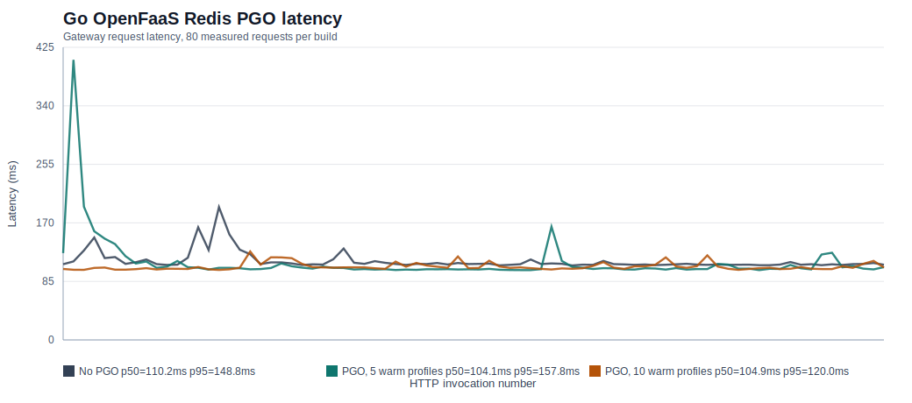
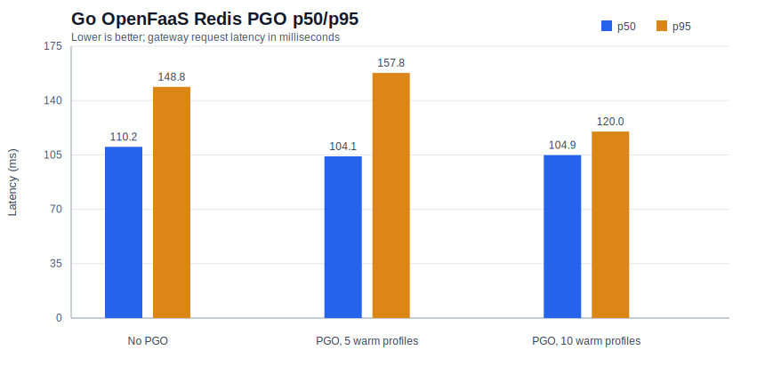

# Go OpenFaaS Redis PGO Results

Run ID: `20260511-165944`

Benchmark target: Go OpenFaaS function using Redis as the profile/cache state backend. The run compared a baseline build with no PGO against two PGO builds trained from warm-profile captures of 5 and 10 baseline invocations.

Environment notes:

- Local `kind` cluster with OpenFaaS gateway on `http://127.0.0.1:8080`.
- Redis deployed in `openfaas-fn`.
- OpenFaaS Community Edition required public function images, so the run used `ttl.sh/go-pgo-redis-maheshk:*`.
- Function scaling was pinned to one replica before measurement to keep warm-profile capture deterministic.

## Summary

| Build | Requests | Mean ms | p50 ms | p95 ms | p99 ms | Max ms | Statuses |
| --- | ---: | ---: | ---: | ---: | ---: | ---: | --- |
| No PGO | 80 | 114.7 | 110.2 | 148.8 | 192.9 | 192.9 | `200: 80` |
| PGO, 5 warm profiles | 80 | 112.7 | 104.1 | 157.8 | 406.9 | 406.9 | `200: 80` |
| PGO, 10 warm profiles | 80 | 106.7 | 104.9 | 120.0 | 128.5 | 128.5 | `200: 80` |

Against the no-PGO baseline, the 10-profile PGO build improved mean latency by about 7.0%, p50 by about 4.8%, and p95 by about 19.3%. The 5-profile PGO build improved mean and p50, but had one tail-latency outlier that made p95/p99 worse.

## Graphs

## Artifacts

- Raw benchmark outputs: `prototypes/go-openfaas-redis-pgo/.runs/20260511-165944/results`
- Captured warm profiles: `prototypes/go-openfaas-redis-pgo/.runs/20260511-165944/profiles`
- Combined summary: `docs/figures/go-openfaas-redis-pgo-summary.json`
- Plot generator: `prototypes/go-openfaas-redis-pgo/plot_openfaas_results.py`
