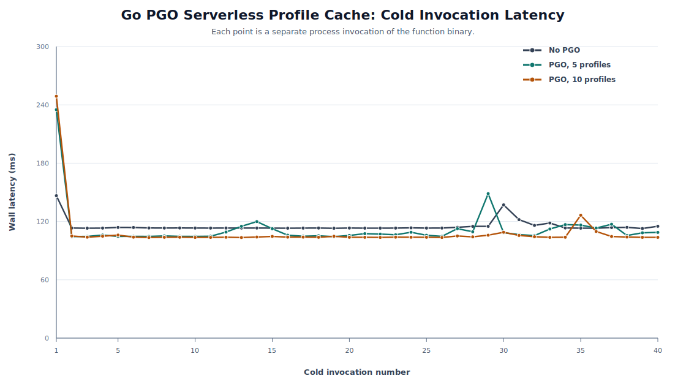
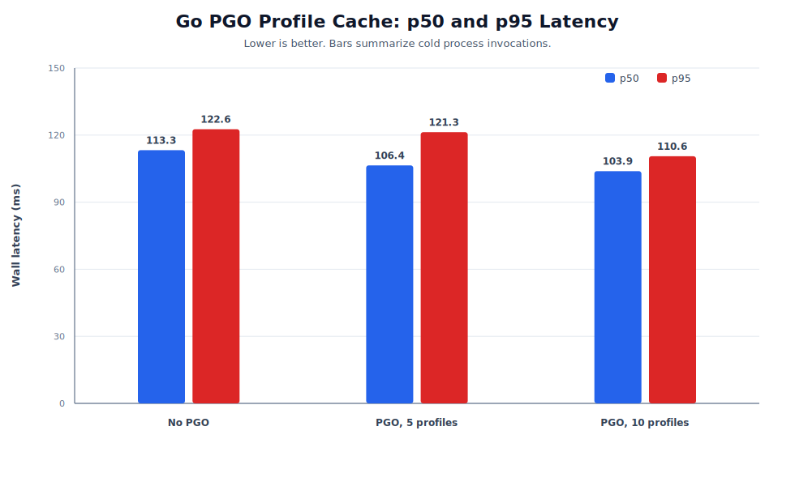
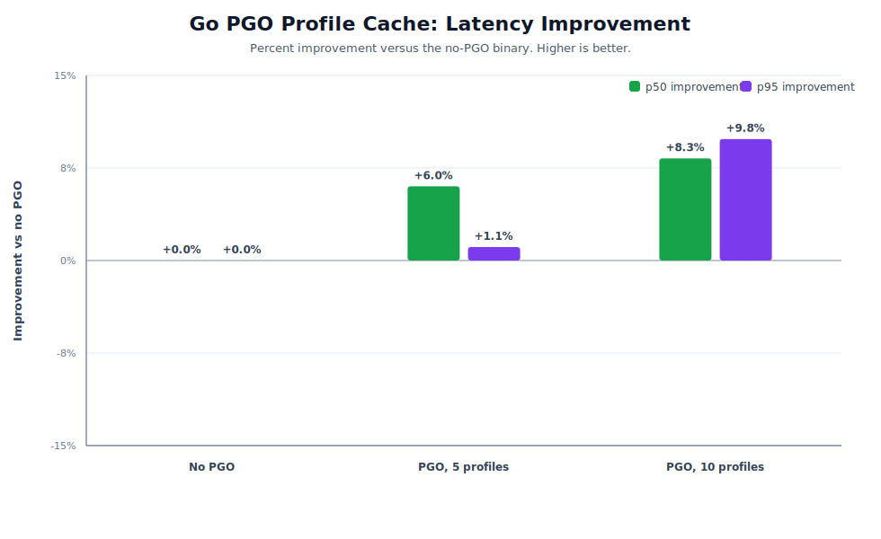

# Go PGO Profile-Cache Results

This note captures the graphable version of the Go serverless profile-cache prototype.

## System Loop

```text
baseline cold execution -> pprof export -> profile merge -> go build -pgo -> optimized cold execution
```

The Go version is an AOT profile-import system. Unlike the George JVM prototype, stock Go does not load a profile at process startup. The serverless controller has to rebuild the next function artifact with the merged profile.

## Figures







## Latest Graph Run

Run id: `go-pgo-graphs-20260511`

| build | n | mean wall ms | p50 wall ms | p95 wall ms |
|---|---:|---:|---:|---:|
| No PGO | 40 | 131.057 | 113.981 | 200.212 |
| PGO, 5 profiles | 40 | 108.796 | 103.365 | 122.443 |
| PGO, 10 profiles | 40 | 113.733 | 105.839 | 159.453 |

In this run, both profile-guided builds improve median and tail latency versus the no-PGO binary. The five-profile build is strongest here, which is a useful caveat: more profile samples are not automatically better unless they are representative of the same workload mix.

## Reading The Graphs

- `No PGO` is the baseline Go binary compiled with `-pgo=off`.
- `PGO, 5 profiles` exports five baseline CPU profiles, merges them, and rebuilds the handler with `go build -pgo`.
- `PGO, 10 profiles` repeats the same cache/import flow with ten profiling invocations.
- Each invocation in the curve graph is a separate process, which approximates serverless cold function execution.

The useful takeaway is not just that one bar is lower. The important end-to-end result is that the system exports execution evidence from short-lived function instances, persists it outside the instance, and feeds it into a later optimized artifact.
